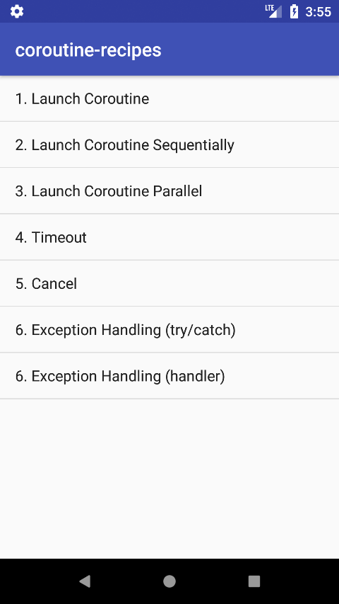

# Learn Kotlin Coroutines for Android by example

Article: [Android Coroutine Recipes](https://medium.com/@dmytrodanylyk/android-coroutine-recipes-33467a4302e9)

Slides: [Android Coroutine Recipes](https://speakerdeck.com/dmytrodanylyk/android-coroutine-recipes)



Contains following examples:

- How to launch a coroutine
- How to launch coroutine with a timeout
- How to launch coroutine which perform 2 background tasks sequentially
- How to launch coroutine which perform 2 background tasks in parallel
- How to cancel a coroutine
- How to catch exception thrown inside coroutine (try/catch)
- How to catch exception thrown inside coroutine (exception handler)
- Lifecycle Aware Coroutine - Lifecycle Observer
- Lifecycle Aware Coroutine - Scoped Fragment

### How to launch a coroutine 

```kotlin
fun loadData() = GlobalScope.launch(uiContext + job) {
    showLoading() // ui thread

    val result = dataProvider.loadData() // non ui thread, suspend until finished

    showText(result) // ui thread
    hideLoading() // ui thread
}
```
You can get full code [here](app/src/main/java/com/dmytrodanylyk/examples/LaunchFragment.kt)

### How to launch coroutine with a timeout

```kotlin
fun loadData() = GlobalScope.launch(uiContext + job) {
    showLoading()

    val result = withTimeoutOrNull(1, TimeUnit.SECONDS) { dataProvider.loadData() }

    showText(result ?: "Timeout")
    hideLoading()
}
```
You can get full code [here](app/src/main/java/com/dmytrodanylyk/examples/LaunchTimeoutFragment.kt)

### How to launch coroutine which perform 2 background tasks sequentially 

```kotlin
fun loadData() = GlobalScope.launch(uiContext + job) {
    showLoading()

    val result1 = dataProvider.loadData()
    val result2 = dataProvider.loadData()

    showText("$result1\n$result2")
    hideLoading()
}
```
You can get full code [here](app/src/main/java/com/dmytrodanylyk/examples/LaunchSequentiallyFragment.kt)

### How to launch coroutine which perform 2 background tasks in parallel 

```kotlin
fun loadData() = GlobalScope.launch(uiContext + job) {
    showLoading()

    val result1 = async { dataProvider.loadData() }
    val result2 = async { dataProvider.loadData() }

    val data = "${result1.await()}\n${result2.await()}"
    showText(data)
    hideLoading()
}
```
You can get full code [here](app/src/main/java/com/dmytrodanylyk/examples/LaunchParallelFragment.kt)

### How to cancel a coroutine 

```kotlin
private var job: Job = Job()

fun loadData() = GlobalScope.launch(uiContext + job) {
    ...
}

override fun onDestroyView() {
    super.onDestroyView()
    job.cancel()
}

```
You can get full code [here](app/src/main/java/com/dmytrodanylyk/examples/CancelFragment.kt)

### How to catch exception thrown inside coroutine (try/catch) [source](app/src/main/java/com/dmytrodanylyk/examples/ExceptionFragment.kt)

```kotlin
fun loadData() = GlobalScope.launch(uiContext + job) {
    showLoading()

    try {
        val result = dataProvider.loadData()
        showText(result)
    } catch (e: IllegalArgumentException) {
        showText(e.message ?: "")
    }

    hideLoading()
}
```
You can get full code [here](app/src/main/java/com/dmytrodanylyk/examples/ExceptionHandlerFragment.kt)

### How to catch exception thrown inside coroutine (exception handler) 

```kotlin
val exceptionHandler: CoroutineContext = CoroutineExceptionHandler { _, throwable ->
    showText(throwable.message ?: "")
    hideLoading()
    job = Job() // exception handler cancels job
}

// we can attach CoroutineExceptionHandler to parent context
fun loadData() = GlobalScope.launch(uiContext + job + exceptionHandler) {
    ...
}
```
You can get full code [here](app/src/main/java/com/dmytrodanylyk/examples/ExceptionHandlerFragment.kt)

# Lifecycle Aware Coroutine - Lifecycle Observer

You can get full code [here](app/src/main/java/com/dmytrodanylyk/examples/LifecycleAwareFragment.kt)

```kotlin
class MainScope : CoroutineScope, LifecycleObserver {

    private lateinit var job: Job
    override val coroutineContext: CoroutineContext
        get() = job + Dispatchers.Main

    @OnLifecycleEvent(Lifecycle.Event.ON_START)
    fun onCreate() {
        job = Job()
    }

    @OnLifecycleEvent(Lifecycle.Event.ON_PAUSE)
    fun destroy() = job.cancel()
}

class MyFragment : ScopedFragment() {

    private val mainScope = MainScope()

    override fun onCreate(savedInstanceState: Bundle?) {
        super.onCreate(savedInstanceState)
        lifecycle.addObserver(mainScope)
    }

    private fun loadData() = mainScope.launch {
        ...
    }
}

```

# Lifecycle Aware Coroutine - Scoped Fragment

You can get full code [here](app/src/main/java/com/dmytrodanylyk/examples/ScopedFragment.kt)

```kotlin
abstract class ScopedFragment : Fragment(), CoroutineScope {

    protected lateinit var job: Job
    override val coroutineContext: CoroutineContext
        get() = job + Dispatchers.Main

    override fun onCreate(savedInstanceState: Bundle?) {
        super.onCreate(savedInstanceState)
        job = Job()
    }

    override fun onDestroy() {
        super.onDestroy()
        job.cancel()
    }
}

class MyFragment : ScopedFragment() {

    private fun loadData() = launch {
        ...
    }
}

```